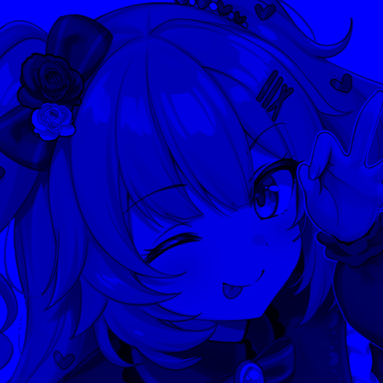
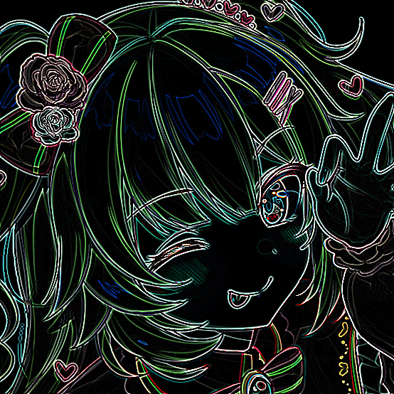
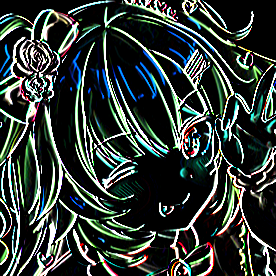
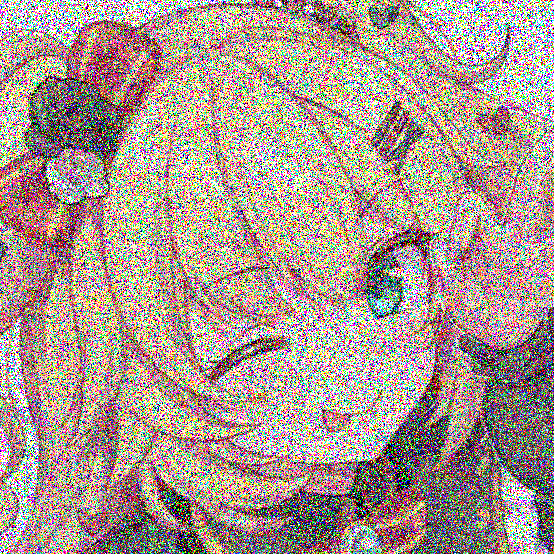
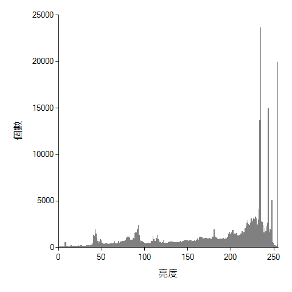
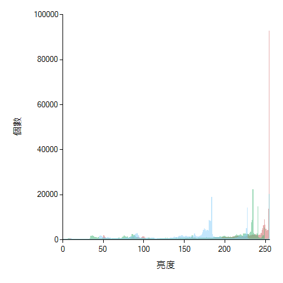

# NTNU-AIP

由 C++/CLI 實作的圖形使用者介面影像處理程式，並使用 OpenMP 進行平行化與優化。

## 安裝

本程式僅能在 Windows 環境下建置和執行，你可以使用下列指令取得完整程式碼與執行檔：
```bash
git https://github.com/OwOb/NTNU-AIP.git
cd NTNU-AIP
```
如果沒有特別的需求，執行 `NTNU-AIP.exe` 即可運行程式。


## 建置環境
若想要自行編譯並建置程式，可參考以下環境：
* Visual Studio 2022
* Windows 10 SDK
* C++ MSVC v143
* C++/CLI v143
* .Net Framework 4.7.2


## 特色
* 具有圖形使用者介面 (GUI)，增加操作方便性。
* 使用 OpenMP 平行化處理圖片，減少處理圖片的時間。
* 使用 Windows 平台內建的 .Net Framework 動態連結函式庫，大幅縮減執行檔的檔案大小。


## 功能與範例
運行程式後會開啟圖形使用者介面，使用者可以從功能列表選擇「開啟圖片」，接著從功能列表中選擇對圖片的操作，操作可以疊加，並且可以透過視窗內所顯示的圖片觀察與原圖片的區別。

<div style="text-align: center"></div>

以下將會介紹可對圖片進行的操作與相對應的結果。

### 檔案
可支援 PNG、JPEG、BMP 的圖片格式。

<table>
  <tr align="center" width="25%">
    <td>輸入圖片</td>
  </tr>
  <tr>
    <td></td>
  </tr>
</table>

### 灰階
<table style="width:75%">
  <tr align="center">
    <td>一般灰階</td>
    <td>均值灰階</td>
    <td>均衡化</td>
  </tr>
  <tr>
    <td></td>
    <td></td>
    <td></td>
  </tr>
</table>

### 色彩
<table style="width:100%">
  <tr align="center">
    <td>紅</td>
    <td>綠</td>
    <td>藍</td>
    <td>負片</td>
  </tr>
  <tr>
    <td></td>
    <td></td>
    <td></td>
    <td></td>
  </tr>
</table>

### 亮度
<table style="width:50%">
  <tr align="center">
    <td>增加亮度</td>
    <td>減少亮度</td>
  </tr>
  <tr>
    <td></td>
    <td></td>
  </tr>
</table>

### 旋轉
<table style="width:75%">
  <tr align="center">
    <td>順時針旋轉 90°</td>
    <td>旋轉 180°</td>
    <td>逆時針旋轉 90°</td>
  </tr>
  <tr>
    <td></td>
    <td></td>
    <td></td>
  </tr>
</table>

### 模糊
<table style="width:50%">
  <tr align="center">
    <td>均值模糊</td>
    <td>高斯模糊</td>
  </tr>
  <tr>
    <td></td>
    <td></td>
  </tr>
</table>

### 邊緣偵測
<table style="width:75%">
  <tr align="center">
    <td>全部邊緣</td>
    <td>水平邊緣</td>
    <td>垂直邊緣</td>
  </tr>
  <tr>
    <td></td>
    <td></td>
    <td></td>
  </tr>
</table>

### 雜訊
<table style="width:100%">
  <tr align="center">
    <td>高斯雜訊 10%</td>
    <td>高斯雜訊 50%</td>
    <td>椒鹽雜訊 10%</td>
    <td>椒鹽雜訊 50%</td>
  </tr>
  <tr>
    <td></td>
    <td></td>
    <td></td>
    <td></td>
  </tr>
</table>

### 統計直方圖
<table style="width:50%">
  <tr align="center">
    <td>亮度統計</td>
    <td>RGB 統計</td>
  </tr>
  <tr>
    <td></td>
    <td></td>
  </tr>
</table>
